# Arista Switch Management Platform

## What is This Application?

The Arista Switch Management Platform is a comprehensive web-based management system designed to centrally manage and monitor Arista network switches. This platform provides network administrators with an intuitive, modern interface to:

- **Manage Multiple Switches**: Add, configure, and monitor multiple Arista switches from a single web interface
- **Configure Network Settings**: Create and manage VLANs, configure interfaces, set up port channels, and manage network configurations
- **Monitor Network Health**: Real-time status monitoring, port activity tracking, and system log viewing
- **Manage Configurations**: Edit switch configurations, create backups, restore previous configurations, and synchronize settings across switches
- **Control Access**: User management with role-based permissions (Admin, Operator, Viewer) and granular access control per switch
- **Maintain Switches**: Firmware management, scheduled restarts, time synchronization, and maintenance operations

The platform communicates with Arista switches using the eAPI (eXtensible API) protocol, allowing for programmatic control and configuration without requiring direct console access to each switch.

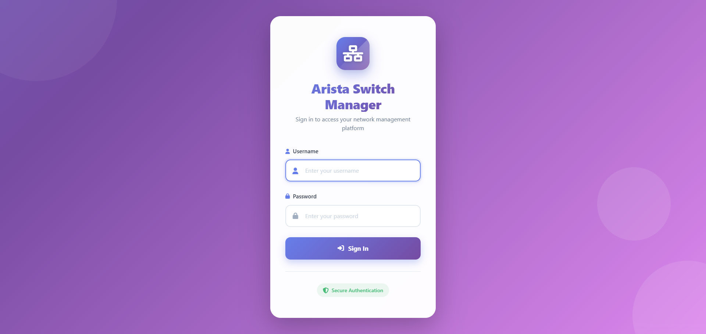

## Table of Contents

- [Features](#features)
- [Requirements](#requirements)
- [Testing & Compatibility](#testing--compatibility)
- [Quick Setup Guide](#quick-setup-guide)
- [Configuration](#configuration)
- [Getting Started](#getting-started)
- [User Guide](#user-guide)
- [Screenshots](#screenshots)
- [API Documentation](#api-documentation)
- [Troubleshooting](#troubleshooting)
- [Contributing](#contributing)
- [Security Considerations](#security-considerations)
- [License](#license)

## Features

### 🔌 Switch Management
- **Add/Edit/Delete Switches**: Manage multiple Arista switches from a single interface
- **Switch Polling**: Real-time status monitoring and health checks
- **Switch Details**: Comprehensive view of switch information, status, and statistics
- **Bulk Operations**: Perform operations on multiple switches simultaneously

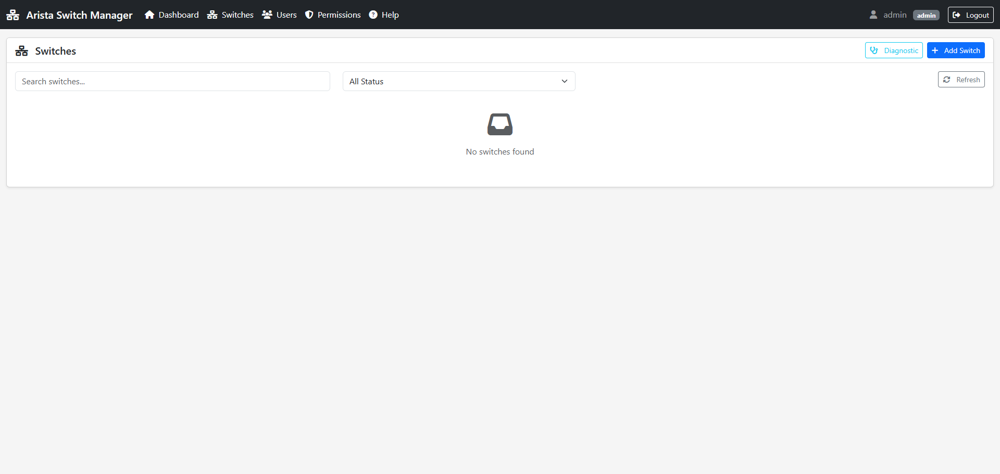

### 🌐 VLAN Management
- **VLAN Creation & Configuration**: Create and manage VLANs across switches
- **VLAN Matrix**: Visual matrix for managing VLAN assignments
- **Trunk Configuration**: Configure trunk ports with multiple VLANs
- **Access Port Configuration**: Set up access ports with single VLAN assignment


### 🔧 Interface Management
- **Interface Configuration**: Configure individual switch interfaces
- **Port Status Monitoring**: Real-time port status and activity monitoring
- **Port Channel Management**: Create and manage port channels (LAG)
- **Transceiver Information**: View SFP/SFP+ transceiver details


### 📝 Configuration Management
- **Configuration Editor**: Edit switch configurations with syntax highlighting
- **Configuration Backup**: Automatic and manual configuration backups
- **Configuration Restore**: Restore previous configurations
- **Configuration Diff**: Compare current vs. backup configurations
- **Configuration Sync**: Synchronize configurations across switches

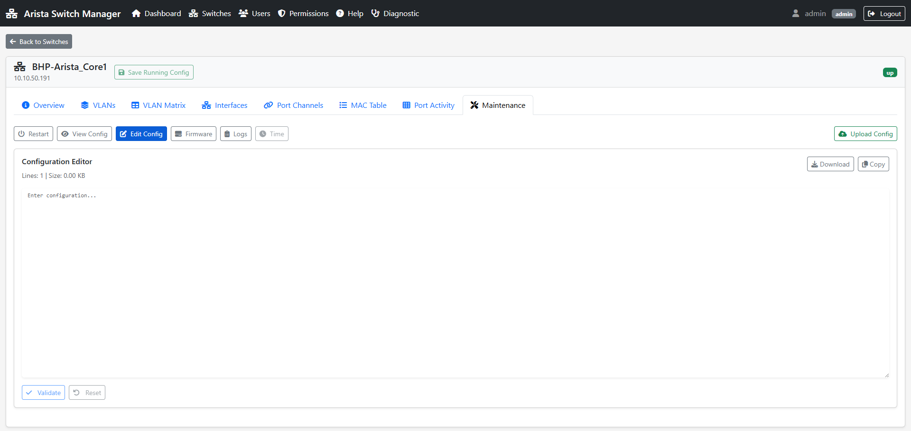

### 🔄 Firmware Management
- **Firmware Upload**: Upload new firmware files to switches
- **Firmware Download**: Download firmware from switches
- **Firmware Version Tracking**: Track firmware versions across switches


### 👥 User & Permission Management
- **User Management**: Create, edit, and delete user accounts
- **Role-Based Access Control**: Admin, Operator, and Viewer roles
- **Permission System**: Granular permission management per switch
- **Audit Logging**: Track all user actions and changes

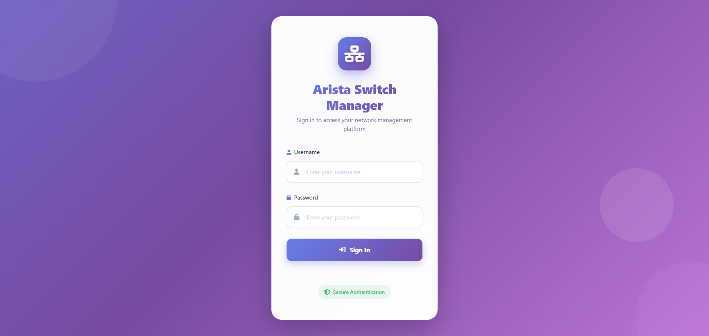

### 📊 Monitoring & Logs
- **Real-time Logs**: View switch logs in real-time
- **MAC Address Table**: View and search MAC address tables
- **Port Activity**: Monitor port activity and statistics
- **Alert System**: Receive alerts for switch issues

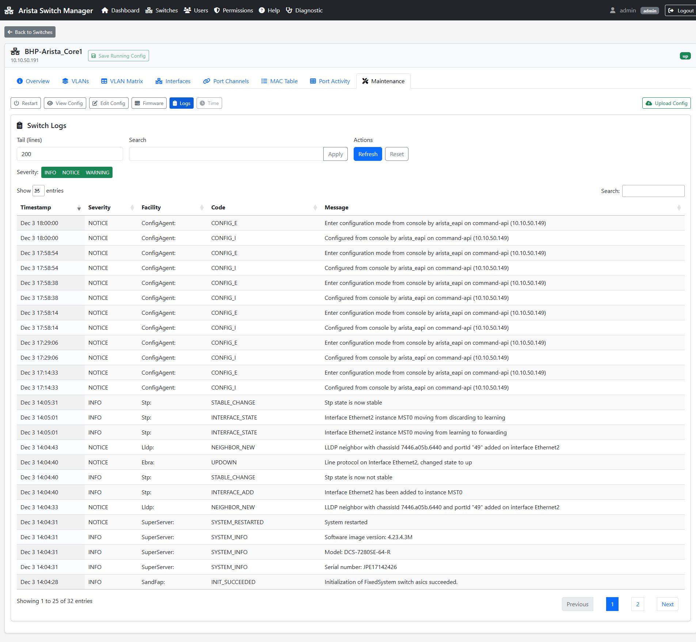

### ⚙️ Advanced Features
- **Time Settings**: Configure NTP and time synchronization
- **Restart Scheduler**: Schedule switch restarts
- **Import/Export**: Import switches from CSV, export configurations
- **Maintenance Mode**: Put switches in maintenance mode

## Requirements

### Server Requirements
- **Web Server**: Apache 2.4+ with mod_rewrite enabled
- **PHP**: PHP 7.4 or higher
- **Database**: MySQL 5.7+ or MariaDB 10.3+
- **Extensions**: 
  - PDO
  - PDO_MySQL
  - JSON
  - cURL
  - OpenSSL

### Network Requirements
- Network connectivity to Arista switches
- Switches must have eAPI enabled
- Appropriate firewall rules for switch communication

### Browser Requirements
- Chrome/Edge 90+
- Firefox 88+
- Safari 14+
- Modern browsers with JavaScript enabled

## Testing & Compatibility

### Tested Hardware
This application has been tested with:
- **Arista 7280SE-64** switch

### Known Limitations
- **Firmware Update Feature**: The firmware update feature has not been tested due to lack of an active Arista support subscription. This feature may require additional testing or configuration.
- **EOS Version Testing**: Testing has been limited to the EOS version available on the test hardware. The application may work with other EOS versions, but comprehensive testing across different versions was not possible without an active support subscription.
- **Switch Model Compatibility**: While the application is designed to work with Arista switches that support eAPI, it has only been tested with the Arista 7280SE-64 model. Other switch models should work but may require additional testing.

### Recommendations
- Test the application with your specific switch models and EOS versions before deploying to production
- Verify firmware update functionality if you have an active support subscription
- Report any compatibility issues or unexpected behavior with different switch models or EOS versions

## Quick Setup Guide

Follow these five steps to get the Arista Switch Management Platform up and running:

### Step 1: Install Files on Web Server

**For XAMPP (Windows):**
- Copy the `arista` folder to `C:\xampp\htdocs\`
- Ensure Apache and MySQL services are running in XAMPP Control Panel

**For Apache (Linux):**
- Copy the project to `/var/www/html/arista/` or your web root
- Ensure mod_rewrite is enabled: `sudo a2enmod rewrite && sudo systemctl restart apache2`

### Step 2: Create Database and Import Schema

1. Create a MySQL/MariaDB database:
   ```sql
   CREATE DATABASE switchdb CHARACTER SET utf8mb4 COLLATE utf8mb4_unicode_ci;
   ```

2. Import the database schema:
   ```bash
   mysql -u root -p switchdb < Exemption/add_permissions_tables.sql
   ```

### Step 3: Configure Database Connection

**IMPORTANT**: You must configure your database connection settings before the application will work.

Edit the file `api/config.php` and update the database configuration section with your database credentials:

```php
// ============================================
// Database Configuration
// ============================================
define('DB_HOST', 'localhost');        // Your database host
define('DB_NAME', 'switchdb');         // Your database name
define('DB_USER', 'your_username');    // Your database username
define('DB_PASS', 'your_password');    // Your database password
define('DB_CHARSET', 'utf8mb4');
```

Replace `your_username` and `your_password` with your actual MySQL/MariaDB credentials.

### Step 4: Set File Permissions (Linux only)

If you're on Linux, ensure the web server can access the files:
```bash
chmod -R 755 frontend/
chmod -R 755 api/
chmod -R 777 firmware/  # If firmware uploads are needed
```

### Step 5: Access the Application and Login

1. Open your web browser and navigate to:
   - **XAMPP**: `http://localhost/arista/`
   - **Linux**: `http://your-server-ip/arista/`

2. You will see the login page. Use the default credentials:
   - **Username**: `admin`
   - **Password**: `password`

3. After logging in, you can:
   - Add your Arista switches
   - Create additional user accounts
   - Configure permissions
   - Start managing your network switches

> **Security Note**: Change the default admin password immediately after first login through the User Management interface. The default credentials (`admin` / `password`) should only be used for initial setup.

## Configuration

### Application Configuration

#### Session Configuration

Edit `api/config.php` to adjust session settings:

```php
define('SESSION_LIFETIME', 3600); // Session timeout in seconds
define('SESSION_COOKIE_SECURE', false); // Set to true for HTTPS
```

#### Security Configuration

```php
define('CSRF_TOKEN_LIFETIME', 3600);
define('MAX_LOGIN_ATTEMPTS', 5);
define('LOGIN_LOCKOUT_TIME', 900); // 15 minutes
```

### Configuring Arista Switches for eAPI

Before you can add switches to the platform, you must configure them to enable eAPI (eXtensible API). The eAPI allows the platform to communicate with your switches programmatically.

#### Prerequisites

- Console or SSH access to your Arista switch
- Administrative privileges on the switch
- Network connectivity between the web server and switch management IP

#### Step-by-Step eAPI Configuration

1. **Connect to the switch console or via SSH**

2. **Enter privileged mode:**
   ```bash
   switch> enable
   switch#
   ```

3. **Enter configuration mode:**
   ```bash
   switch# configure terminal
   switch(config)#
   ```

4. **Enable the management API:**
   ```bash
   switch(config)# management api http-commands
   switch(config-mgmt-api-http)#
   ```

5. **Configure the protocol (HTTP or HTTPS):**
   
   **For HTTP (port 80):**
   ```bash
   switch(config-mgmt-api-http)# protocol http
   ```
   
   **For HTTPS (port 443) - Recommended for production:**
   ```bash
   switch(config-mgmt-api-http)# protocol https
   ```

6. **Enable the API:**
   ```bash
   switch(config-mgmt-api-http)# no shutdown
   ```

7. **Save the configuration:**
   ```bash
   switch(config-mgmt-api-http)# write memory
   ```

8. **Verify eAPI is enabled:**
   ```bash
   switch# show management api http-commands
   ```
   
   You should see output indicating the API is enabled and running.

#### User Permissions Required for eAPI

For eAPI to function properly with the platform, the user account used for eAPI authentication must have **privilege level 15** (full administrative access). This is required because the platform needs to execute configuration commands such as creating VLANs, modifying interfaces, and updating switch configurations.

**Create a user with privilege level 15:**

```bash
switch(config)# username admin privilege 15 secret your_password
switch(config)# exit
switch# write memory
```

**Verify the user has correct privileges:**
```bash
switch# show users
```

You should see your user account listed with privilege level 15.

> **Important**: Replace `admin` with your desired username and `your_password` with a strong password. The `secret` keyword stores the password using a secure hash. Privilege level 15 is required for full CLI access and configuration commands.

#### Configure AAA Authorization for eAPI

By default, eAPI users have limited permissions and cannot enter configuration mode or execute administrative commands. To allow the platform to perform configuration operations (such as creating VLANs, modifying interfaces, etc.), you must configure AAA (Authentication, Authorization, and Accounting) authorization on the switch.

**Why is this needed?**

Without AAA authorization configured, eAPI users will be able to authenticate and run read-only commands (like `show` commands), but they will not be able to execute configuration commands. The platform requires the ability to modify switch configurations, so AAA authorization is essential.

**Configure AAA Authorization:**

1. **Enter configuration mode:**
   ```bash
   switch# configure terminal
   switch(config)#
   ```

2. **Configure AAA authorization for exec sessions:**
   ```bash
   switch(config)# aaa authorization exec default local
   ```
   This command tells the switch to use local authentication for login/exec sessions.

3. **Configure AAA authorization for command execution:**
   ```bash
   switch(config)# aaa authorization commands all default local
   ```
   This command tells the switch to use local authentication for all command execution, allowing the eAPI user to run configuration commands based on their privilege level.

4. **Ensure your eAPI user has privilege level 15:**
   ```bash
   switch(config)# username admin privilege 15
   ```
   (If you already created the user in the previous step, this command ensures it has the correct privilege level)

5. **Save the configuration:**
   ```bash
   switch(config)# exit
   switch# write memory
   ```

**Verify AAA Authorization Configuration:**

```bash
switch# show aaa authorization
switch# show users
```

You should see:
- Authorization method lists configured for "exec" and "commands" using "local"
- Your eAPI user account with privilege level 15

**What this enables:**

Once AAA authorization is configured, your eAPI user will be able to:
- Execute configuration commands (create/modify VLANs, interfaces, etc.)
- Enter configuration mode via eAPI
- Perform all administrative operations required by the platform

> **Note**: If you experience issues with VLAN creation or other configuration operations after setting up eAPI, verify that AAA authorization is properly configured. You can use the **Diagnostic Tool** in the application to test eAPI permissions and identify any authorization issues.

#### Additional eAPI Configuration Options

**Restrict API access to specific IP addresses (optional but recommended):**
```bash
switch(config-mgmt-api-http)# ip access-group API_ACCESS in
switch(config)# ip access-list standard API_ACCESS
switch(config-std-acl)# permit 10.10.50.149  # Your web server IP
switch(config-std-acl)# deny any
```

**Enable HTTPS with SSL certificate (for production):**
```bash
switch(config-mgmt-api-http)# protocol https
switch(config-mgmt-api-http)# ssl profile SSL_PROFILE
```

**View current eAPI status:**
```bash
switch# show management api http-commands
```

#### Testing eAPI Connectivity

After configuring eAPI, you can test connectivity using the **Diagnostic Tool** in the application (see [Diagnostic Tool](#diagnostic-tool) section below) or manually test with curl:

```bash
curl -k https://switch-ip-address/command-api -u username:password -d '{"jsonrpc": "2.0", "method": "runCmds", "params": {"version": 1, "cmds": ["show version"]}, "id": 1}'
```

> **Note**: For detailed step-by-step instructions on configuring switches, including factory reset, setting IP addresses, and configuring passwords, see the **Help** section within the application (accessible from the main navigation menu).

## Getting Started

### First Login

1. Navigate to `http://localhost/arista/` (or your server URL)
2. You'll see the login page
3. Use the default credentials to log in:
   - **Username**: `admin`
   - **Password**: `password`

> **Important**: After your first login, immediately change the default password through the User Management interface for security.

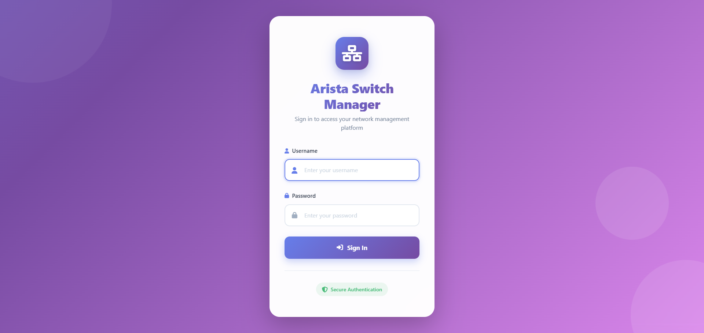

### Dashboard Overview

After logging in, you'll see the main dashboard with:
- Switch list with status indicators
- Quick action buttons
- Navigation menu
- User information

### Built-in Help and Diagnostic Tools

The application includes two built-in tools to assist with setup and troubleshooting:

#### Help Section

The **Help** section (accessible from the main navigation menu) provides step-by-step guides for:

- **Factory Reset Switch**: Instructions for resetting a switch to factory defaults
- **Set IP Address**: How to configure the management IP address on a switch
- **Set Admin Password**: Steps to change the switch administrator password
- **Enable & Configure eAPI**: Detailed instructions for enabling eAPI on Arista switches
- **Configure AAA Authorization**: Guide for setting up authentication, authorization, and accounting

These guides are especially useful when setting up new switches or troubleshooting connectivity issues.

#### Diagnostic Tool

The **Diagnostic** tool (accessible from the main navigation menu) is an interactive eAPI diagnostic utility that helps you:

- **Test Switch Connectivity**: Verify network connectivity to your switches
- **Test eAPI Functionality**: Check if eAPI is properly configured and responding
- **Run Individual Tests**: Select specific diagnostic tests to run
- **Override Credentials**: Test with different credentials without modifying switch settings
- **View Detailed Results**: See real-time test execution and detailed error messages

**Using the Diagnostic Tool:**

1. Click the **Diagnostic** button in the main navigation
2. Select a switch from the dropdown (or use custom credentials)
3. Choose which tests to run (or run all tests)
4. Click **Run Tests** to execute diagnostics
5. Review the results to identify any connectivity or configuration issues

The diagnostic tool is particularly useful when:
- Adding a new switch and verifying connectivity
- Troubleshooting why a switch appears offline
- Testing eAPI configuration changes
- Verifying credentials before adding a switch

## User Guide

### Adding a Switch

1. Click **"Add Switch"** button (Admin/Operator only)
2. Fill in the switch details:
   - **Hostname**: Friendly name for the switch
   - **IP Address**: Management IP address
   - **Username**: eAPI username
   - **Password**: eAPI password
   - **Description**: Optional description
3. Click **"Add Switch"** to save

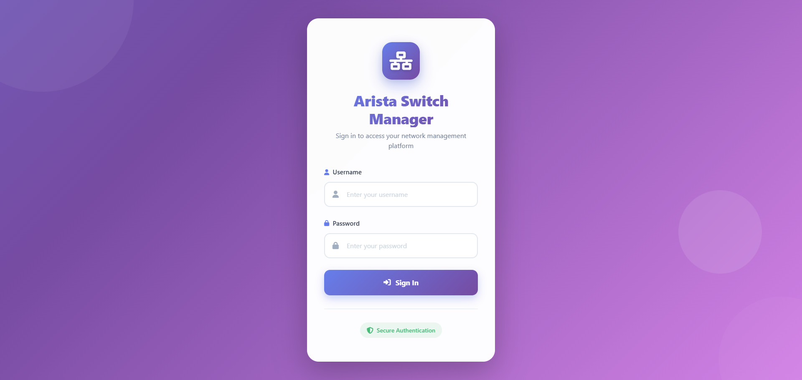

### Viewing Switch Details

1. Click on a switch name in the switch list
2. View comprehensive switch information:
   - General information
   - Interface status
   - VLAN configuration
   - Configuration files
   - Logs
   - MAC address table

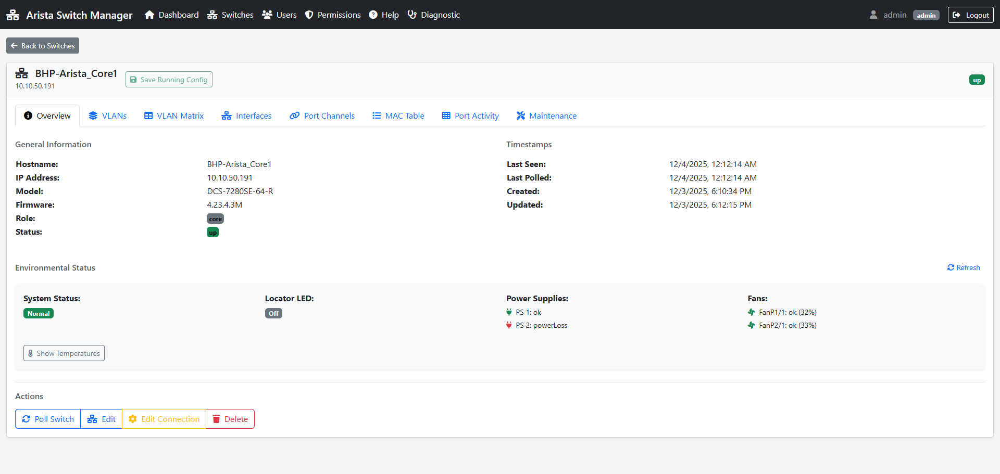

### Managing VLANs

#### Creating a VLAN

1. Navigate to **VLAN Management** from the menu
2. Select a switch
3. Click **"Create VLAN"**
4. Enter VLAN ID and name
5. Configure VLAN settings
6. Click **"Create"**

#### Configuring Trunk Ports

1. Go to **Interface Management**
2. Select an interface
3. Set interface mode to **"Trunk"**
4. Select VLANs to allow on the trunk
5. Save configuration

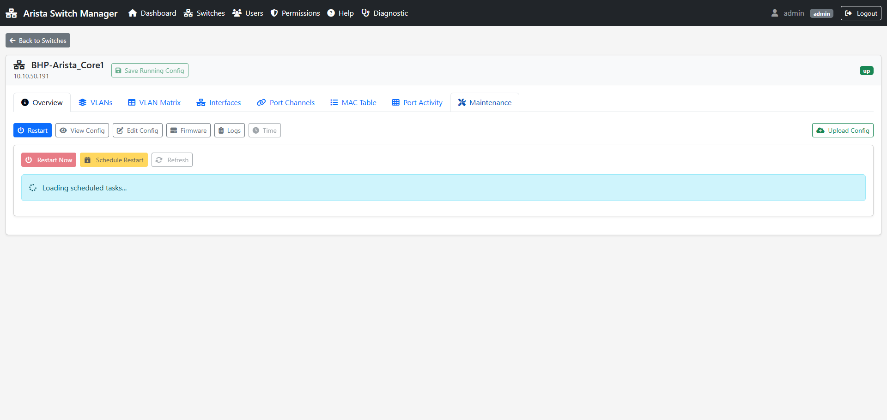

### Editing Switch Configuration

1. Open switch details
2. Navigate to **"Configuration"** tab
3. Click **"Edit Configuration"**
4. Make your changes in the editor
5. Click **"Save"** to apply changes
6. Optionally create a backup before applying

### Managing Users

1. Navigate to **User Management** (Admin only)
2. Click **"Add User"**
3. Fill in user details:
   - Username
   - Password
   - Role (Admin, Operator, Viewer)
4. Assign permissions to specific switches
5. Click **"Create User"**

### Setting Permissions

1. Go to **Permission Management**
2. Select a user
3. Grant or revoke permissions:
   - **View**: Can view switch information
   - **Edit**: Can edit switch configurations
   - **Delete**: Can delete switches
4. Permissions can be set per switch

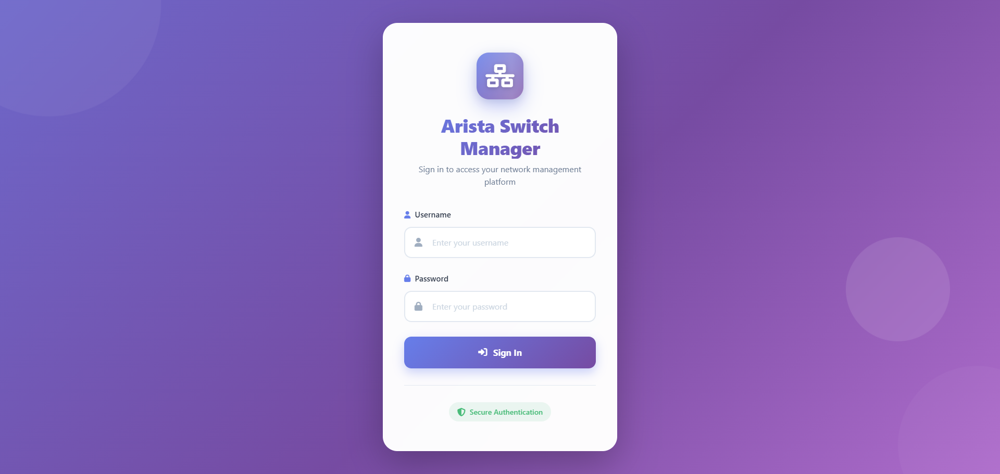

### Monitoring Port Activity

1. Open switch details
2. Navigate to **"Port Activity"** tab
3. View real-time port statistics:
   - Port status (Up/Down)
   - Traffic statistics
   - Error counters
   - Utilization graphs

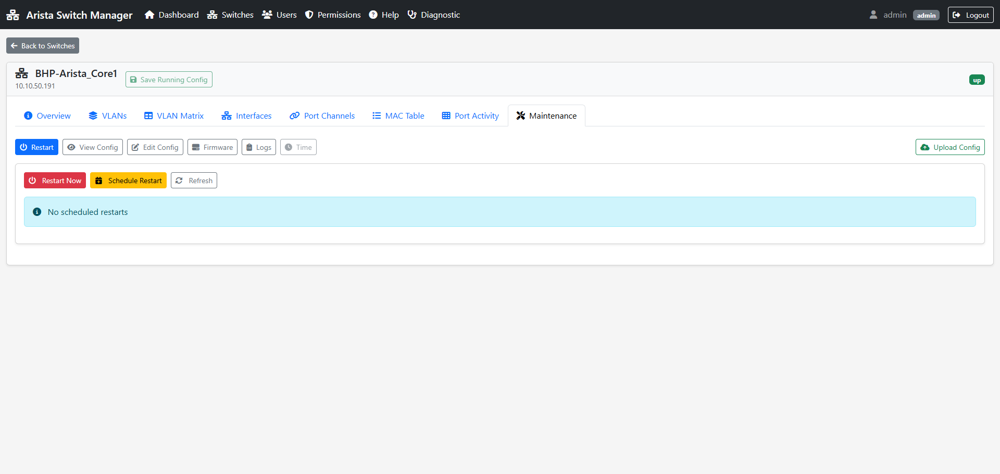

### Viewing Logs

1. Open switch details
2. Go to **"Logs"** tab
3. View system logs, interface logs, or configuration logs
4. Use filters to search specific log entries
5. Export logs if needed

### Firmware Management

1. Navigate to **Firmware Manager**
2. Select a switch
3. **Upload Firmware**:
   - Click "Upload Firmware"
   - Select firmware file
   - Upload to switch
4. **Download Firmware**:
   - View current firmware version
   - Download firmware from switch

## Screenshots

The following screenshots demonstrate key features of the platform:

### Main Dashboard

*Main dashboard showing switch list and status*

### Switch List

*List of all managed switches with status indicators*

### VLAN Management

*VLAN configuration interface*

### Interface Management

*Interface configuration and status*

### Configuration Editor

*Switch configuration editor with syntax highlighting*

### Firmware Management

*Firmware upload and management interface*

### User Management

*User account management interface*

### Logs Viewer

*Real-time log viewing interface*

### Login Page

*User login interface*

### Add Switch Form

*Form for adding new switches*

### Switch Details

*Detailed switch information view*

### VLAN Configuration

*VLAN creation and configuration*

### Permission Management

*User permission management interface*

### Port Activity

*Port activity monitoring and statistics*

## API Documentation

### Authentication

All API endpoints require authentication via session cookies.

#### Login
```
POST /arista/api/auth/login.php
Body: { "username": "admin", "password": "password" }
```

#### Session Check
```
GET /arista/api/auth/session.php
```

#### Logout
```
POST /arista/api/auth/logout.php
```

### Switch Management

#### List Switches
```
GET /arista/api/switches/list.php
```

#### Get Switch Details
```
GET /arista/api/switches/get.php?id={switch_id}
```

#### Add Switch
```
POST /arista/api/switches/add.php
Body: {
  "hostname": "switch1",
  "ip_address": "192.168.1.1",
  "username": "admin",
  "password": "password"
}
```

#### Update Switch
```
POST /arista/api/switches/update.php
Body: { "id": 1, "hostname": "new-name", ... }
```

#### Delete Switch
```
POST /arista/api/switches/delete.php
Body: { "id": 1 }
```

#### Poll Switch
```
POST /arista/api/switches/poll.php
Body: { "id": 1 }
```

### VLAN Management

#### List VLANs
```
GET /arista/api/switches/vlans/list.php?switch_id={id}
```

#### Create VLAN
```
POST /arista/api/switches/vlans/create.php
Body: {
  "switch_id": 1,
  "vlan_id": 100,
  "name": "VLAN100"
}
```

#### Update VLAN
```
POST /arista/api/switches/vlans/update.php
Body: { "switch_id": 1, "vlan_id": 100, ... }
```

#### Delete VLAN
```
POST /arista/api/switches/vlans/delete.php
Body: { "switch_id": 1, "vlan_id": 100 }
```

### Configuration Management

#### Get Configuration
```
GET /arista/api/switches/config/get.php?switch_id={id}
```

#### Save Configuration
```
POST /arista/api/switches/config/save.php
Body: {
  "switch_id": 1,
  "config": "hostname switch1\n..."
}
```

#### Backup Configuration
```
POST /arista/api/switches/config/backup.php
Body: { "switch_id": 1 }
```

#### Restore Configuration
```
POST /arista/api/switches/config/restore.php
Body: { "switch_id": 1, "backup_id": 1 }
```

### User Management

#### List Users
```
GET /arista/api/users/list.php
```

#### Create User
```
POST /arista/api/users/create.php
Body: {
  "username": "user1",
  "password": "password",
  "role": "operator"
}
```

#### Update User
```
POST /arista/api/users/update.php
Body: { "id": 1, "username": "new-name", ... }
```

#### Delete User
```
POST /arista/api/users/delete.php
Body: { "id": 1 }
```

## Troubleshooting

### Common Issues

#### Cannot Connect to Switches

**Problem**: Switches show as "Offline" or connection fails.

**Solutions**:
1. Verify switch IP addresses are correct
2. Ensure switches have eAPI enabled
3. Check network connectivity
4. Verify firewall rules allow connections
5. Confirm username/password are correct

#### Database Connection Errors

**Problem**: "Database connection failed" error.

**Solutions**:
1. Verify database credentials in `api/config.php`
2. Ensure MySQL/MariaDB service is running
3. Check database exists: `SHOW DATABASES;`
4. Verify user has proper permissions

#### Session Expires Too Quickly

**Problem**: Getting logged out frequently.

**Solutions**:
1. Increase `SESSION_LIFETIME` in `api/config.php`
2. Check server time synchronization
3. Clear browser cookies and cache

#### Configuration Changes Not Saving

**Problem**: Configuration edits don't persist.

**Solutions**:
1. Verify switch connectivity
2. Check switch permissions
3. Review error logs in browser console
4. Ensure configuration syntax is valid

#### CSS/JS Files Not Loading

**Problem**: Page appears unstyled or JavaScript errors.

**Solutions**:
1. Clear browser cache (Ctrl+F5)
2. Verify `.htaccess` file is present
3. Check Apache mod_rewrite is enabled
4. Verify file paths in `index.html` are correct

### Debug Mode

Enable debug logging by checking browser console (F12) for detailed error messages.

### Getting Help

1. **Use the Built-in Help Section**: The application includes a comprehensive Help section accessible from the main navigation menu with step-by-step guides for switch configuration
2. **Use the Diagnostic Tool**: The Diagnostic tool can help identify connectivity and eAPI configuration issues
3. Review error logs in the Logs Viewer
4. Check browser console for JavaScript errors (F12)
5. Review Apache error logs

## Contributing

Contributions are welcome! Please follow these guidelines:

1. Fork the repository
2. Create a feature branch (`git checkout -b feature/amazing-feature`)
3. Commit your changes (`git commit -m 'Add amazing feature'`)
4. Push to the branch (`git push origin feature/amazing-feature`)
5. Open a Pull Request

### Code Style

- Follow PSR-12 for PHP code
- Use ESLint for JavaScript
- Comment complex logic
- Write descriptive commit messages

## Security Considerations

### Production Deployment

Before deploying to production:

1. **Change Default Credentials**: Update all default passwords
2. **Enable HTTPS**: Configure SSL/TLS certificates
3. **Update Security Settings**: Set `SESSION_COOKIE_SECURE` to `true`
4. **Restrict Database Access**: Use dedicated database user with minimal permissions
5. **Review File Permissions**: Ensure proper file/directory permissions
6. **Regular Updates**: Keep PHP and dependencies updated
7. **Backup Regularly**: Implement automated backup strategy
8. **Monitor Logs**: Set up log monitoring and alerts

### Best Practices

- Use strong passwords for all accounts
- Regularly review user permissions
- Keep switches updated with latest firmware
- Monitor audit logs for suspicious activity
- Implement network segmentation
- Use firewall rules to restrict access

## License

[Specify your license here]

## Support

For support, please:
- Open an issue on GitHub
- Check the documentation
- Review the Help section in the application

## Acknowledgments

- Built with Vue.js 3
- Uses Bootstrap 5 for UI
- Arista eAPI for switch communication
- DataTables for data presentation

---

**Version**: 1.0.0  
**Last Updated**: 2024
